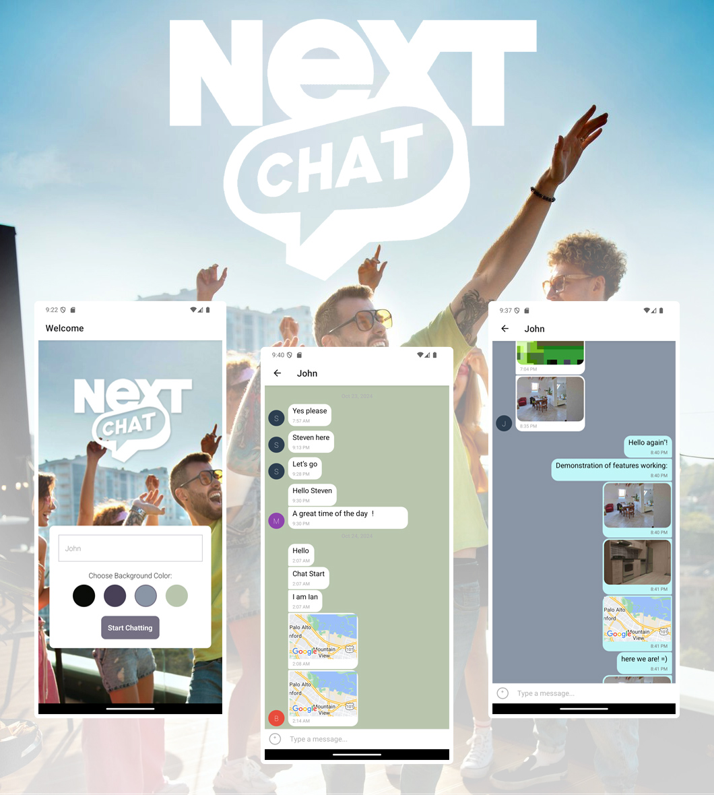

# NextChat 📱

A React Native Mobile Chat Application

## 🎯 Objective

NextChat is a feature-rich mobile chat application built with React Native, allowing users to communicate easily through text, images, and location sharing. Our goal is to create a user-friendly chat app for mobile devices, providing a seamless communication experience.

<p align="center">
  
</p>

## 🌟 Key Features

- User-friendly chat interface
- Image sharing capabilities
- Real-time location sharing
- Offline message reading
- Customizable chat room backgrounds
- Screen reader compatibility for accessibility

## 🛠️ Technical Stack

- React Native
- Expo
- Google Firestore Database
- Google Firebase Authentication
- Gifted Chat library

## 📋 User Stories

- Easy chat room entry for quick conversations
- Sending text messages to friends and family
- Sharing images of current activities
- Sharing location data
- Offline message access
- Accessibility for users with visual impairments

## 🔧 Technical Requirements

- Developed using React Native and Expo
- Styled according to provided screen design
- Chat conversations stored in Google Firestore Database
- Anonymous user authentication via Google Firebase
- Local storage of chat conversations
- Image picking from phone's library and camera integration
- Firebase Cloud Storage for image storage
- Device location data reading and sharing
- Gifted Chat library for chat interface and functionality
- Well-commented codebase

## 📱 Supported Platforms

- iOS
- Android

## 💾 Data Storage

- Online storage: Google Firestore Database
- Offline storage: Local device storage

## 🔒 Authentication

- Anonymous authentication via Google Firebase

## 📸 Image Handling

- Pick images from phone's library
- Take photos using device's camera
- Store images in Firebase Cloud Storage

## 🗺️ Location Sharing

- Read user's location data
- Send location data in map view via chat

## ♿ Accessibility

- Compatible with screen readers for users with visual impairments

## 🚀 Setup Instructions

### Prerequisites

1. Node.js (v16 or newer)
2. Expo CLI: `npm install -g expo-cli`
3. Android Studio (for Android development)
4. Xcode (for iOS development, Mac only)
5. Firebase account

### Development Environment Setup

1. **Install Expo Go** on your physical device:
   * iOS: [App Store](https://apps.apple.com/app/expo-go/id982107779)
   * Android: [Google Play](https://play.google.com/store/apps/details?id=host.exp.exponent)

2. **Clone the repository**:
   ```bash
   git clone https://github.com/your-username/nextchat.git
   cd nextchat
   ```

3. **Install dependencies**:
   ```bash
   npm install
   ```

### Firebase Setup

1. Create a new Firebase project at [Firebase Console](https://console.firebase.google.com/)

2. Enable the following Firebase services:
   * Authentication (Anonymous)
   * Cloud Firestore
   * Storage

3. Configure Firebase in your app:
   * Go to Project Settings > Your Apps
   * Create a new web app
   * Copy the firebaseConfig object
   * Replace the configuration in `App.js`:
   ```javascript
   const firebaseConfig = {
     apiKey: "your-api-key",
     authDomain: "your-auth-domain",
     projectId: "your-project-id",
     storageBucket: "your-storage-bucket",
     messagingSenderId: "your-messaging-sender-id",
     appId: "your-app-id"
   };
   ```

4. Set up Firestore Security Rules:
   ```
   rules_version = '2';
   service cloud.firestore {
     match /databases/{database}/documents {
       match /{document=**} {
         allow read, write: if request.auth != null;
       }
     }
   }
   ```

### Required Dependencies

The following packages are required for NextChat:

```bash
npm install @react-navigation/native @react-navigation/native-stack
npm install firebase
npm install @react-native-async-storage/async-storage
npm install @react-native-community/netinfo
npm install expo-image-picker
npm install expo-location
npm install expo-media-library
npm install react-native-gifted-chat
npm install react-native-maps
npm install @expo/react-native-action-sheet
```

### Running the App

1. **Start the development server**:
   ```bash
   expo start
   ```

2. **Run on simulator/emulator**:
   * Press 'i' for iOS simulator (Mac only)
   * Press 'a' for Android emulator

3. **Run on physical device**:
   * Scan the QR code with Expo Go app
   * Make sure your device is on the same network as your development machine

### Troubleshooting Common Issues

1. **Metro Bundler Issues**:
   ```bash
   expo start --clear
   ```

2. **Android Emulator Network Error**:
   * In Android Studio, go to Tools > AVD Manager
   * Edit your virtual device and ensure it has Play Store enabled

3. **iOS Simulator Camera/Location**:
   * Features like camera and location services need to be tested on physical devices

### Environment Variables (Optional)

For additional security, you can move Firebase configuration to a `.env` file:

1. Create `.env` file in project root
2. Add Firebase configuration:
   ```
   FIREBASE_API_KEY=your-api-key
   FIREBASE_AUTH_DOMAIN=your-auth-domain
   FIREBASE_PROJECT_ID=your-project-id
   FIREBASE_STORAGE_BUCKET=your-storage-bucket
   FIREBASE_MESSAGING_SENDER_ID=your-messaging-sender-id
   FIREBASE_APP_ID=your-app-id
   ```
3. Install `react-native-dotenv`:
   ```bash
   npm install react-native-dotenv
   ```

---

This project showcases proficiency in React Native development and demonstrates the ability to create a fully-functional, feature-rich mobile application.
